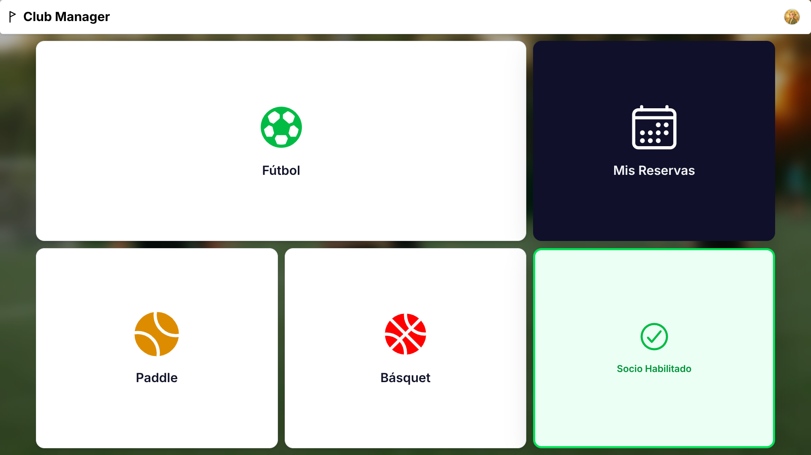
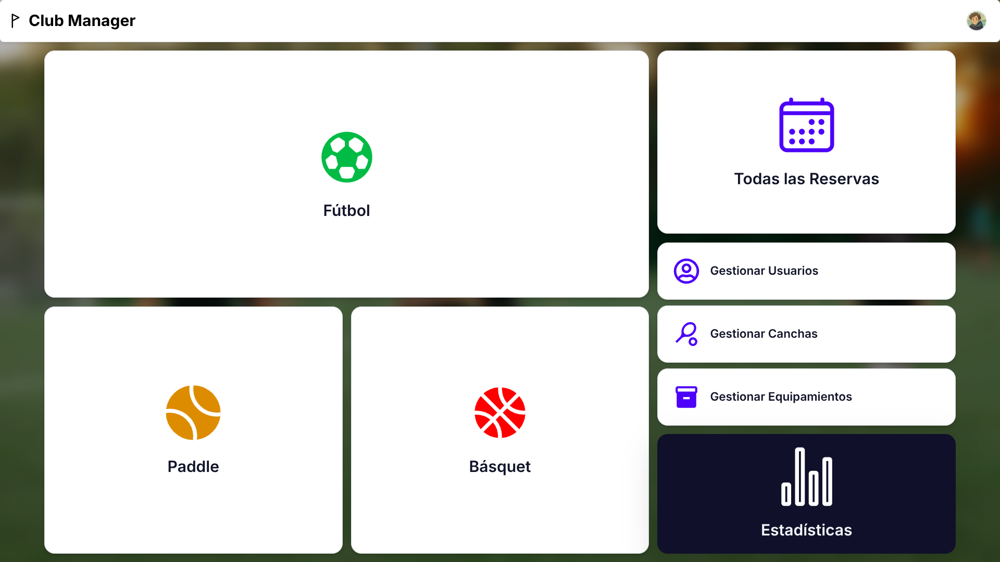
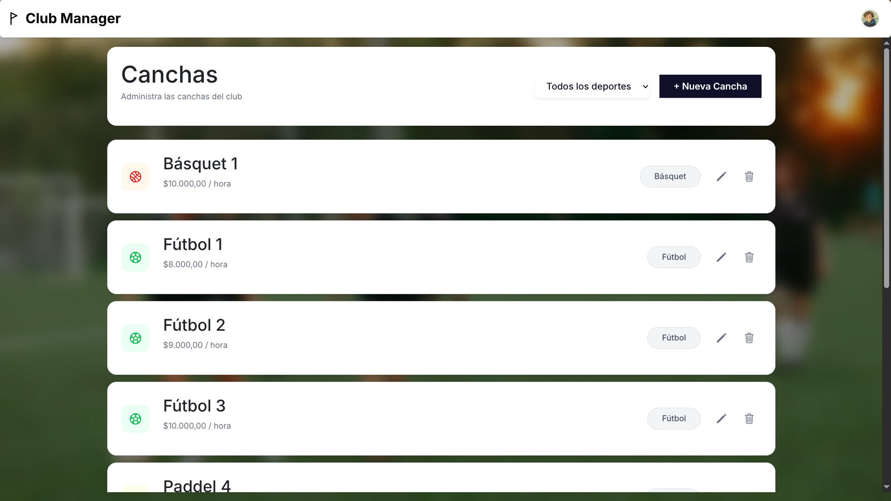
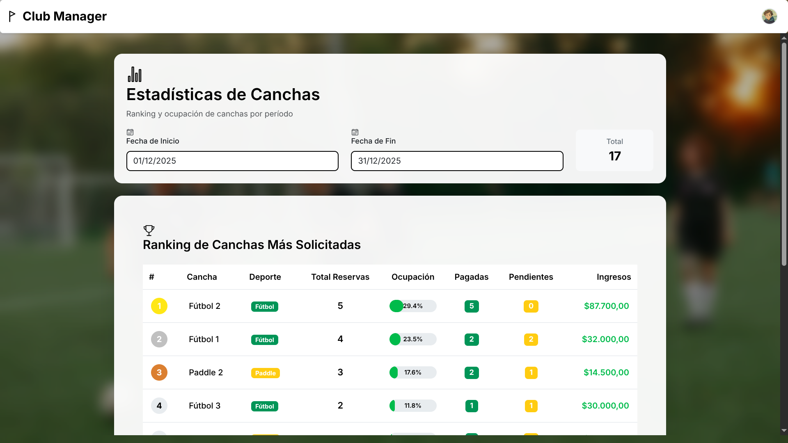
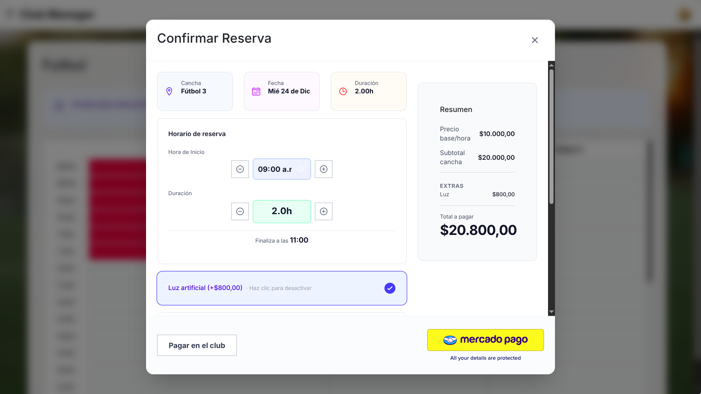

# Club Manager
[](https://github.com/TomasKoch03/Club_Manager_frontend/actions/workflows/deploy.yml)

> Sistema integral de gestión para clubes deportivos desarrollado con arquitectura moderna fullstack

---

## 🎯 Descripción del Proyecto

**Club Manager** es una plataforma web completa diseñada para optimizar la gestión de clubes deportivos, permitiendo la administración eficiente de reservas, canchas, equipamiento y socios. Desarrollado como proyecto final de la materia **Gestión del Desarrollo de Sistemas Informáticos** en la **Facultad de Ingeniería de la Universidad de Buenos Aires (FIUBA)**.

El proyecto fue ejecutado siguiendo metodologías ágiles profesionales, desde el estudio de mercado inicial hasta el deployment en producción, aplicando las mejores prácticas de desarrollo de software moderno.

---

## 📸 Galería

### Panel del Socio

*Interfaz principal para usuarios socios con acceso a reservas, perfil y estado de pagos*

### Grid de Reservas

*Sistema de reservas interactivo con visualización de disponibilidad en tiempo real*

### Panel de Administración

*Dashboard administrativo con gestión completa de usuarios, canchas y equipamiento*

### Gestión de Canchas

*Administración de canchas con control de disponibilidad, precios y características*

### Estadísticas de Canchas

*Reportes y estadísticas de uso y ocupación de canchas para análisis de negocio*

### Sistema de Pagos

*Integración con Mercado Pago para procesamiento seguro de pagos*

---

## ✨ Características Principales

### Para Socios
- 🏟️ **Reserva de canchas** con grid interactivo de horarios
- 📅 **Vista de calendario** para visualizar disponibilidad
- 💳 **Procesamiento de pagos** integrado con Mercado Pago
- 🎾 **Alquiler de equipamiento** deportivo
- 👤 **Gestión de perfil** con carga de imágenes
- 📊 **Historial de reservas** con detalles de pagos
- ✏️ **Edición y cancelación** de reservas

### Para Administradores
- 📋 **Dashboard administrativo** con estadísticas en tiempo real
- 🏟️ **Gestión completa de canchas** (crear, editar, eliminar, activar/desactivar)
- ⚽ **Gestión de equipamiento** con control de stock y disponibilidad
- 👥 **Administración de usuarios** con roles y permisos
- 💰 **Reportes de pagos** por fecha y estado
- 📈 **Estadísticas** de uso y ocupación de canchas
- 🔍 **Búsqueda y filtrado** avanzado de reservas

---

## 🚀 Stack Tecnológico

### Backend
- **Framework:** FastAPI (Python 3.11+)
- **Base de Datos:** MySQL con SQLAlchemy ORM
- **Autenticación:** JWT (JSON Web Tokens)
- **Validación:** Pydantic v2
- **Testing:** pytest + Behave (BDD)
- **Integración de Pagos:** Mercado Pago SDK
- **Procesamiento de Imágenes:** Pillow
- **Seguridad:** bcrypt, python-jose

### Frontend
- **Framework:** React 19 + Vite
- **UI Framework:** Bootstrap 5 + Tailwind CSS 4
- **Routing:** React Router DOM v7
- **Gestión de Estado:** Context API
- **Iconos:** React Icons
- **Generación de PDFs:** jsPDF
- **Utilidades:** date-fns para manejo de fechas
- **Integración de Pagos:** Mercado Pago SDK React

### DevOps & Deployment
- **Containerización:** Docker + Docker Compose
- **CI/CD:** GitHub Actions
- **Backend Hosting:** Railway
- **Frontend Hosting:** GitHub Pages
- **Control de Versiones:** Git + GitHub

---

## 🏗️ Arquitectura del Sistema

### Backend - Arquitectura Hexagonal

El backend implementa una arquitectura limpia y desacoplada siguiendo el patrón hexagonal:

```
app/
├── domain/          # Lógica de negocio pura (entidades y validaciones)
├── models/          # Modelos de SQLAlchemy (persistencia)
├── schemas/         # Schemas de Pydantic (DTOs)
├── repositories/    # Capa de acceso a datos
├── services/        # Lógica de aplicación e inyección de dependencias
├── routers/         # Controladores de API (endpoints)
└── utils/           # Utilidades (seguridad, imágenes)
```

**Beneficios de esta arquitectura:**
- ✅ Separación clara de responsabilidades
- ✅ Facilita el testing unitario
- ✅ Código mantenible y escalable
- ✅ Independencia de frameworks externos

### Frontend - Arquitectura por Capas

```
src/
├── components/      # Componentes reutilizables
├── pages/          # Vistas principales de la aplicación
├── layouts/        # Layouts compartidos
├── services/       # Comunicación con API
├── contexts/       # Gestión de estado global
├── hooks/          # Custom hooks
└── utils/          # Funciones auxiliares
```

---

## 🔄 Proceso de Desarrollo

El proyecto se desarrolló siguiendo la metodología **SCRUM** con un enfoque profesional en la gestión:

### 1️⃣ Investigación Inicial
- **Estudio de mercado** mediante entrevistas a potenciales usuarios
- Creación de **Personas** y **Mapas de Empatía** para entender necesidades
- Análisis competitivo de sistemas existentes

### 2️⃣ Planificación
- **WBS (Work Breakdown Structure)** para descomponer el proyecto
- **User Story Mapping** para definir funcionalidades
- Creación de **Product Backlog** en Jira
- Priorización usando técnica **MoSCoW** (Must, Should, Could, Won't)
- Estimación de esfuerzo con **Planning Poker**

### 3️⃣ Ejecución
- **3 Sprints** de 2 semanas cada uno
- **Daily Standups** para sincronización del equipo
- **Sprint Reviews** para demostrar avances
- **Sprint Retrospectives** para mejora continua

### 4️⃣ Calidad
- **Testing unitario** con pytest (backend)
- **Testing de aceptación BDD** con Behave
- **Code reviews** obligatorios en pull requests
- **CI/CD Pipeline** automático con GitHub Actions

---

## 🧪 Testing y Calidad

### Backend Testing
```bash
# Tests unitarios
pytest tests/

# Tests de aceptación BDD
behave features/
```

**Cobertura de tests:**
- ✅ Domain layer (lógica de negocio)
- ✅ Repository layer (acceso a datos)
- ✅ Service layer (casos de uso)
- ✅ Features BDD (escenarios de usuario)

**Ejemplos de features BDD:**
- Registro de usuarios
- Edición de información de usuario
- Listado de reservas pagadas
- Reportes de pagos por fecha
- Búsqueda de reservas por rango

### Pipeline CI/CD

**Backend (GitHub Actions → Railway):**
1. Checkout del código
2. Construcción de imagen Docker
3. Ejecución de tests unitarios y BDD
4. Deploy automático a Railway (en main)

**Frontend (GitHub Actions → GitHub Pages):**
1. Checkout del código
2. Instalación de dependencias
3. Build de producción con Vite
4. Deploy automático a GitHub Pages (en deploy)

---

## 🔐 Seguridad

- **Autenticación JWT** con tokens de acceso
- **Encriptación de contraseñas** usando bcrypt
- **Validación de datos** en frontend y backend
- **CORS configurado** para dominios permitidos
- **Variables de entorno** para secretos
- **Rate limiting** en endpoints sensibles

---

## 📊 Funcionalidades Técnicas Destacadas

### Sistema de Reservas Inteligente
- Validación de conflictos de horarios
- Bloqueo de reservas en horarios ocupados
- Cálculo automático de disponibilidad
- Estados de reserva (pendiente, confirmada, cancelada)

### Integración con Mercado Pago
- Creación de preferencias de pago
- Webhooks para notificaciones de pago
- Actualización automática de estado de reservas
- Manejo de callbacks de éxito/fallo

### Gestión de Imágenes
- Upload de imágenes de perfil
- Validación de formato y tamaño
- Almacenamiento optimizado
- Servido eficiente de archivos estáticos

### Sistema de Roles y Permisos
- Middleware de autenticación
- Decoradores para verificación de roles
- Endpoints protegidos por rol (admin/socio)
- Control granular de acceso

---

## 🚢 Deployment

### Backend - Railway
```bash
# Configuración automática desde GitHub
- Build: Docker
- Deploy: Automático en push a main
- Database: MySQL en Railway
- Variables de entorno: Configuradas en Railway Dashboard
```

### Frontend - GitHub Pages
```bash
# Build optimizado con Vite
npm run build

# Deploy automático con GitHub Actions
- Trigger: Push a branch 'deploy'
- Output: Carpeta dist/
- URL: https://[usuario].github.io/Club_Manager_frontend
```

---

## 📝 Documentación Técnica

### API Documentation
La API cuenta con documentación interactiva generada automáticamente por FastAPI:
- **Swagger UI:** `/docs`
- **ReDoc:** `/redoc`

### Endpoints Principales

**Autenticación:**
- `POST /api/users/register` - Registro de usuarios
- `POST /api/users/login` - Inicio de sesión

**Canchas:**
- `GET /api/courts` - Listar canchas
- `POST /api/courts` - Crear cancha (admin)
- `PUT /api/courts/{id}` - Actualizar cancha (admin)
- `DELETE /api/courts/{id}` - Eliminar cancha (admin)

**Reservas:**
- `GET /api/reservations` - Listar reservas
- `POST /api/reservations` - Crear reserva
- `PUT /api/reservations/{id}` - Editar reserva
- `DELETE /api/reservations/{id}` - Cancelar reserva

**Pagos:**
- `POST /api/mercadopago/create-preference` - Crear preferencia de pago
- `POST /api/mercadopago/webhook` - Webhook de notificaciones

---

## 🛠️ Instalación y Ejecución Local

### Prerequisitos
- Docker & Docker Compose
- Node.js 18+
- Python 3.11+

### Backend

```bash
# Clonar repositorio
git clone [repo-backend]
cd Club_Manager_bakend

# Configurar variables de entorno
cp .env.example .env

# Levantar con Docker
docker-compose up -d

# O ejecutar localmente
python -m venv venv
source venv/bin/activate  # Windows: venv\Scripts\activate
pip install -r requirements.txt
uvicorn main:app --reload
```

### Frontend

```bash
# Clonar repositorio
git clone [repo-frontend]
cd Club_Manager_frontend

# Instalar dependencias
npm install

# Configurar variables de entorno
cp .env.example .env

# Ejecutar en desarrollo
npm run dev

# Build para producción
npm run build
```

---

## 👥 Equipo de Desarrollo

Proyecto desarrollado por un equipo de estudiantes de Ingeniería en Informática de FIUBA para la materia **Gestión del Desarrollo de Sistemas Informáticos**.

### Desarrolladores
- **Tomás Koch**
- **Ignacio Ezequiel Vetrano**
- **Santino Peiretti**
- **Mateo Riat Sapulia**
- **Paula Consoli**

---

## 📚 Aprendizajes Clave

### Técnicos
- ✅ Arquitectura de software limpia y escalable
- ✅ Integración de servicios de terceros (Mercado Pago)
- ✅ CI/CD pipelines automatizados
- ✅ Testing integral (unitario + BDD)
- ✅ Deployment en múltiples plataformas

### Gestión de Proyectos
- ✅ Metodologías ágiles (SCRUM)
- ✅ Gestión de backlog con Jira
- ✅ Estimación y planificación de sprints
- ✅ Trabajo colaborativo con Git
- ✅ Code reviews y estándares de código

### Soft Skills
- ✅ Comunicación efectiva en equipo
- ✅ Resolución de conflictos
- ✅ Adaptación a cambios de requerimientos
- ✅ Presentación de resultados a stakeholders

---

## 🔗 Links

- **[Repositorio Backend](https://github.com/TomasKoch03/Club_Manager_bakend)**
- **[Repositorio Frontend](https://github.com/TomasKoch03/Club_Manager_frontend)**
- **[Informe Final](./assets/Club%20Manager%20-%20Informe%20Final.pdf)**

---

## 📄 Licencia

Este proyecto fue desarrollado con fines académicos para FIUBA.

---

## 🙏 Agradecimientos

A la cátedra **Turri** de **Gestión del Desarrollo de Sistemas Informáticos** de FIUBA por su guía durante el desarrollo del proyecto, y a todo el equipo de desarrollo por su dedicación y trabajo colaborativo.

---
